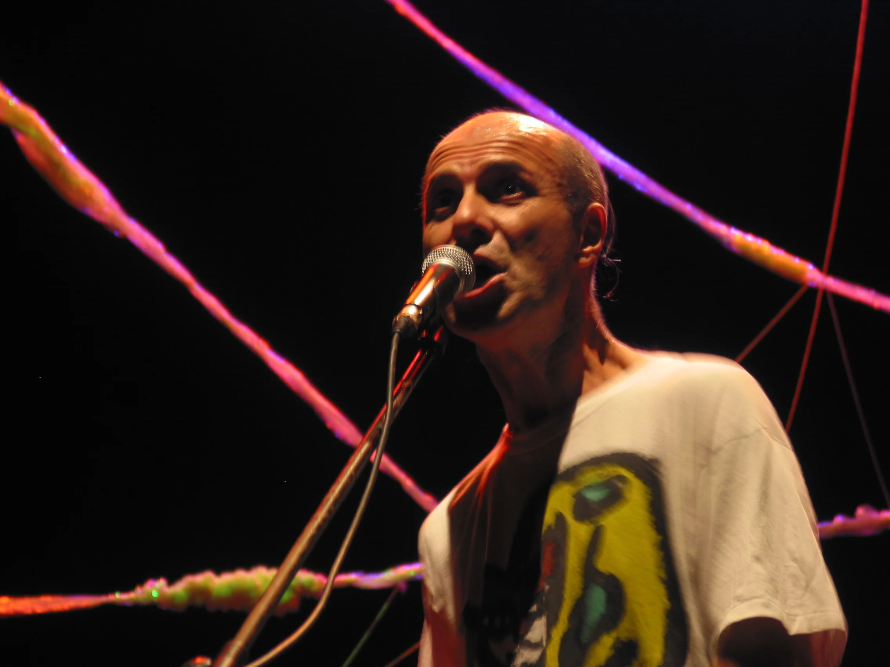

# hectorbardanca.uy



## Sobre este proyecto

Este es el sitio web de **Héctor Bardanca** — músico, performer, escritor, editor y productor uruguayo. Un archivo vivo de su obra: discos, videos, textos y fotografías, presentados en un feed vertical continuo con navegación por filtros.

El sitio fue construido con la convicción de que **el código es una forma de escritura**, y que publicar un sitio web puede ser un acto tan creativo como componer una canción o escribir un poema. Por eso este proyecto es de **código abierto**.

## Código abierto, arte abierto

La cultura se construye sobre lo que otros hicieron antes. La música de Bardanca dialoga con Lazaroff, con Mateo, con la tradición rioplatense y con lo que viene después. Del mismo modo, este sitio dialoga con el código que otros escribieron y liberaron.

**Este repositorio puede ser clonado, estudiado, modificado y reutilizado.** Si sos artista, músico, escritor o performer y necesitás un sitio para tu obra, podés tomar este como punto de partida. No hace falta pedir permiso. El arte no se guarda, se libera.

Lo que encontrás acá:
- Un sitio tipo portfolio/archivo con feed filtrable
- Reproductor de audio integrado con tracklists por disco
- Videos embebidos desde Archive.org
- CMS para editar contenido sin tocar código (Sveltia CMS)
- Navegación con interletra variable y colores dinámicos por sección
- Audio ambiental con control global
- Deploy automático en Cloudflare Pages

## Stack

| Componente | Tecnología |
|---|---|
| Generador | [Astro](https://astro.build) |
| CMS | [Sveltia CMS](https://sveltiacms.app) |
| Estilos | CSS vanilla |
| Tipografía | [Inter](https://rsms.me/inter/) |
| Hosting | [Cloudflare Pages](https://pages.cloudflare.com) |
| Videos | [Archive.org](https://archive.org) |
| Repositorio | [GitHub](https://github.com/catuy/hectorbardanca.uy) |

## Estructura

```
src/
├── content/posts/
│   ├── videos/          # Posts de video (embeds de Archive.org)
│   ├── discos/          # Posts de disco (cover + tracklist con player)
│   ├── fotos/           # Posts de fotografía
│   ├── textos/          # Posts de texto (ensayos, poesía)
│   └── bio/             # Biografía
├── components/          # Componentes Astro por tipo de post
├── layouts/             # Layout base
└── pages/               # Página principal (index.astro)

public/
├── assets/
│   ├── audio/           # MP3s organizados por disco
│   └── img/             # Imágenes optimizadas (WebP)
├── admin/               # Sveltia CMS (config.yml + index.html)
├── styles/              # CSS
└── scripts/             # JavaScript (player, filtros, nav)
```

## Cómo usarlo

### Clonar y correr en local

```bash
git clone https://github.com/catuy/hectorbardanca.uy.git
cd hectorbardanca.uy
npm install
npm run dev
```

El sitio corre en `http://localhost:4321`.

### Editar contenido

Cada post es un archivo Markdown en `src/content/posts/`. Se puede editar directamente o usar el CMS visual:

1. Correr el proxy local: `npx decap-server`
2. Abrir `http://localhost:4321/admin/index.html`

En producción, el CMS funciona en `https://tusitio.com/admin/` autenticando con GitHub.

### Crear un nuevo post

Crear un archivo `.md` en la carpeta del tipo correspondiente (`videos/`, `discos/`, `fotos/`, `textos/`, `bio/`) con el frontmatter:

```yaml
---
type: video          # video | disco | texto | foto | bio
title: "Título"
order: 10            # posición en el feed (menor = más arriba)
embed: "url"         # para videos
artist: "Artista"    # para discos
cover: /assets/img/cover.webp  # para discos
tracks:              # para discos
  - title: "Track 1"
    file: /assets/audio/album/track.mp3
bgColor: "#000000"   # color de fondo (opcional)
textColor: "#ffffff"  # color de texto (opcional)
fullscreen: true      # ancho completo (opcional, para fotos y videos)
---

Contenido en Markdown (para textos y bio)
```

### Deploy

El sitio se despliega automáticamente en Cloudflare Pages con cada push a `master`.

Para configurar tu propio deploy:

1. Crear un proyecto en Cloudflare Pages conectado al repo
2. Build command: `npm run build`
3. Output directory: `dist`

---

*Héctor Bardanca (Montevideo, 1954) — músico, performer, escritor.*

*Sitio desarrollado al cuidado de [Diego Cataldo](https://github.com/catuy).*
